# WhatsApp Dashboard

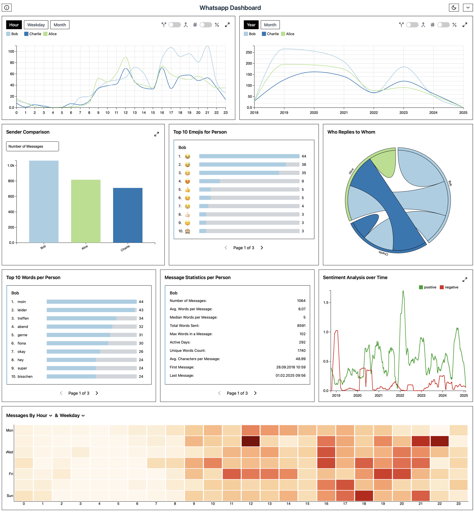

WhatsApp Dashboard is a powerful, interactive web application built with React that allows users to analyze and visualize WhatsApp chat data in an intuitive and engaging way. It provides deep insights into messaging patterns, sender statistics, sentiment trends, and much more. Whether you're curious about your own messaging habits, want to explore group dynamics, or simply enjoy data visualization, this tool offers a rich and user-friendly experience.

The application is designed to work seamlessly with `.txt` files exported from WhatsApp and supports multiple languages, including German, English, French, and Spanish. The entire data processing pipeline runs locally in the user's browser, ensuring privacy and security by never uploading any data to external servers. Users can filter messages based on sender, date range, and minimum message contribution to refine their analysis.

A variety of interactive plots and charts are available to visualize data in different ways, from tracking message activity over time to exploring sentiment analysis and emoji usage. The app is particularly useful for identifying communication trends, detecting high-activity periods, and understanding the distribution of messages among participants in group chats.

## Live Demo

[WhatsApp Dashboard](https://whatsapp-dashboard.friedrichvoelkers.de/)

## Table of Contents

- [Features](#features)
- [Demo](#demo)
- [Installation](#installation)
- [Usage](#usage)
- [Project Structure](#project-structure)
- [Technologies Used](#technologies-used)
- [Contributing](#contributing)
- [License](#license)

## Features

### Local Processing

- No data is sent to any external server; all processing is done locally in the browser.

### File Upload

- Supports `.txt` files exported from WhatsApp.
- Works with both iOS and Android exported chat files.

### Advanced Filtering Options

- Filter messages by:
  - Specific senders
  - Certain weekdays
  - Start and end date range
  - Minimum percentage of messages per person

### Interactive Visualizations

The dashboard includes a variety of charts to help analyze chat data.

#### 1. **Message Trends Over Time (AggregatePerTime.tsx)**

- Displays the number of messages sent per sender over different time frames:
  - **By hour of the day** (e.g., when are users most active?)
  - **By day of the week** (e.g., which days see the most conversations?)
  - **By month** (e.g., how does chat activity vary by month?)
- Users can toggle between:
  - Absolute message counts
  - Percentage-based representation (how much each person contributed overall)
  - Summation of messages
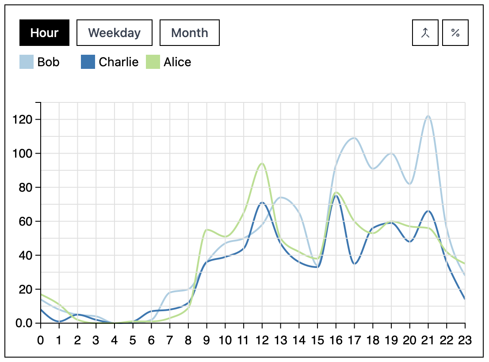

#### 2. **Message Timeline (Timeline.tsx)**

- Visualizes the number of messages sent by each user over time.
- Users can toggle between absolute values and percentages.
- Allows users to see message trends across different months and years.
- 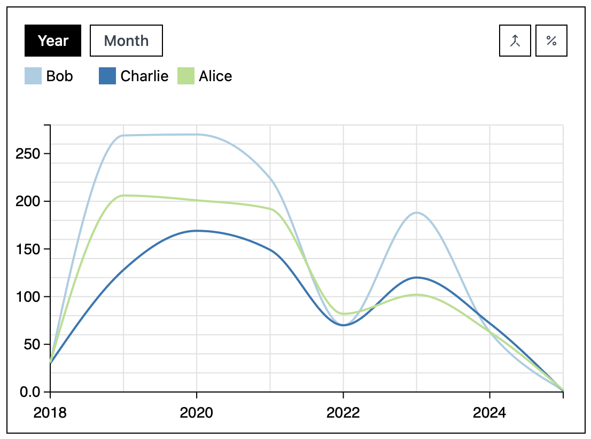

#### 3. **Sender Comparison (BarChartComp.tsx)**

- Compares different participants based on various message-related statistics.
- 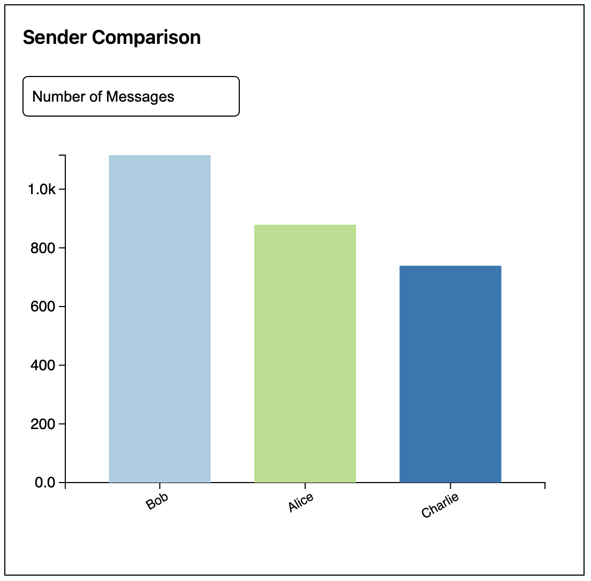

#### 4. **Top 10 Emojis per Person (Emoji.tsx)**

- Shows the most frequently used emojis per sender.
- Helps analyze the emoji preferences of different participants.
- 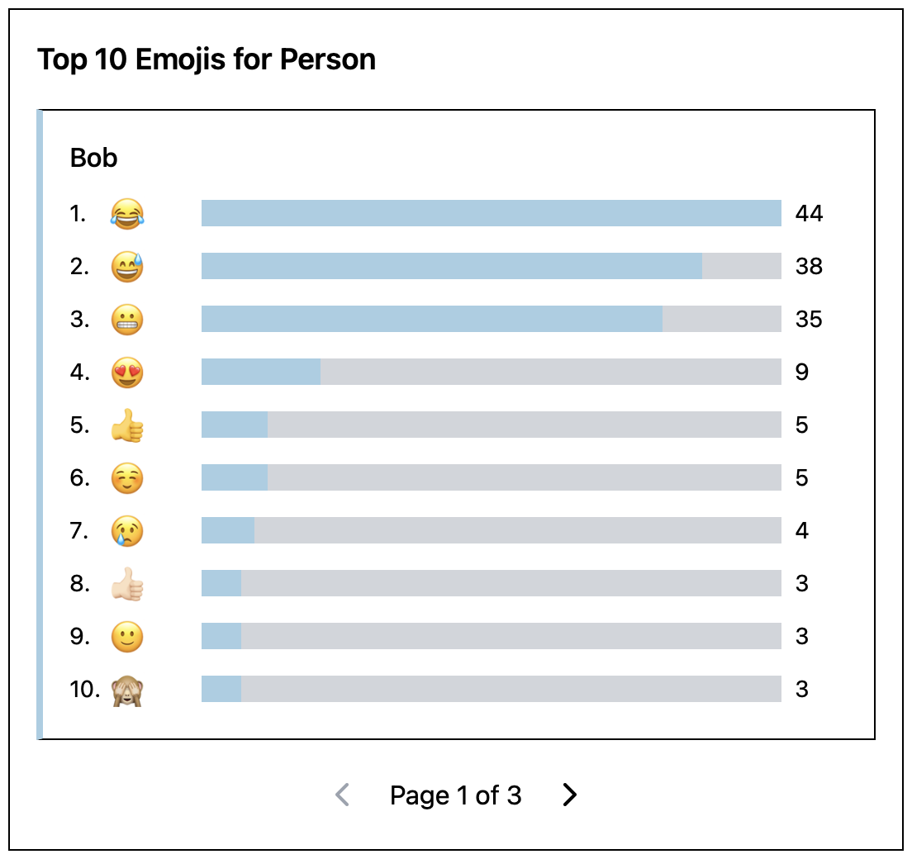

#### 5. **Reply Patterns (ChordDiagram.tsx)**

- Visualizes which users respond most frequently to whom using a chord diagram.
- Helps understand conversation dynamics in group chats.
- 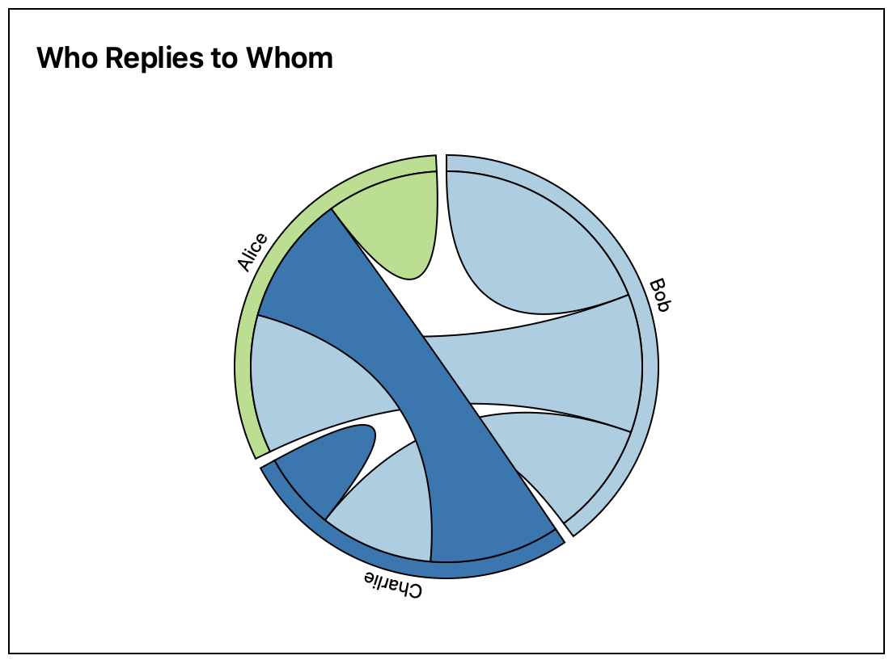

#### 6. **Most Used Words (WordCount.tsx)**

- Displays the most commonly used words for each sender.
- Stopwords (e.g., "the," "and," "or") are automatically removed based on the selected language.
- Available for German, English, French, and Spanish.
- 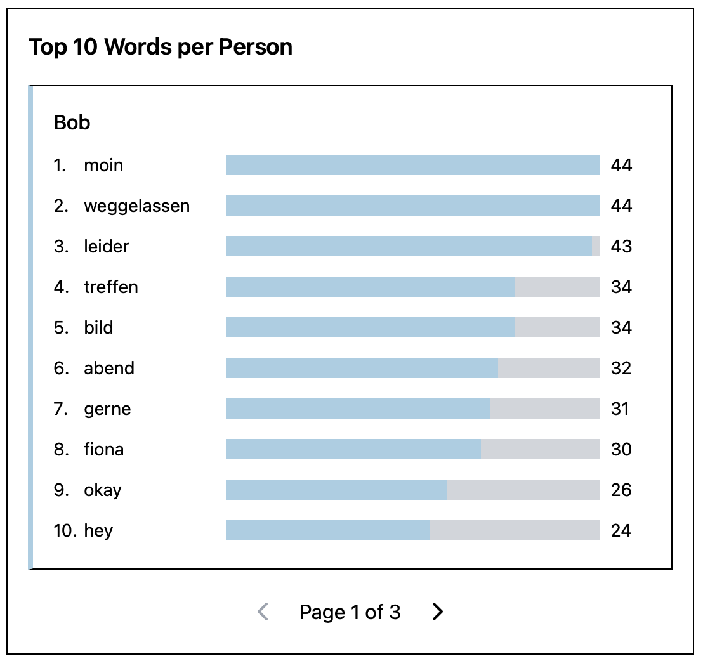

#### 7. **Message Statistics per Person (Stats.tsx)**

- Displays detailed message statistics for each user.
- 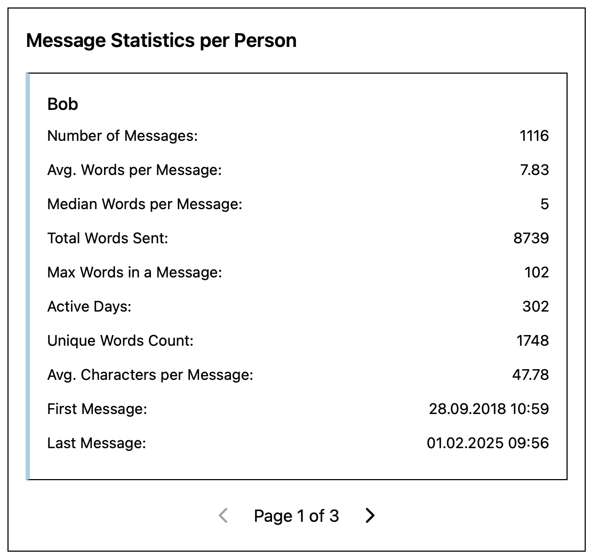

#### 8. **Sentiment Analysis Over Time (Sentiment.tsx)**

- Analyzes the overall sentiment of messages using AFINN-based sentiment scoring.
- Messages are classified as positive, negative, or neutral.
- The sentiment trend is displayed over time.
- 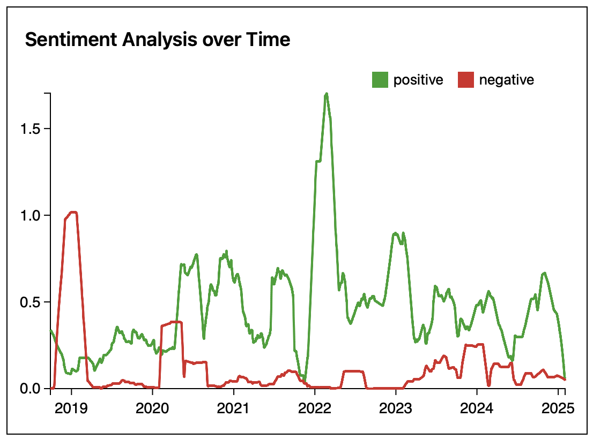

#### 9. **Best and Worst Words per Person (SentimentWord.tsx)**

- Identifies the words that contribute most to positive and negative sentiment per person.
- Displays the top 10 most positive and top 10 most negative words for each participant.
- 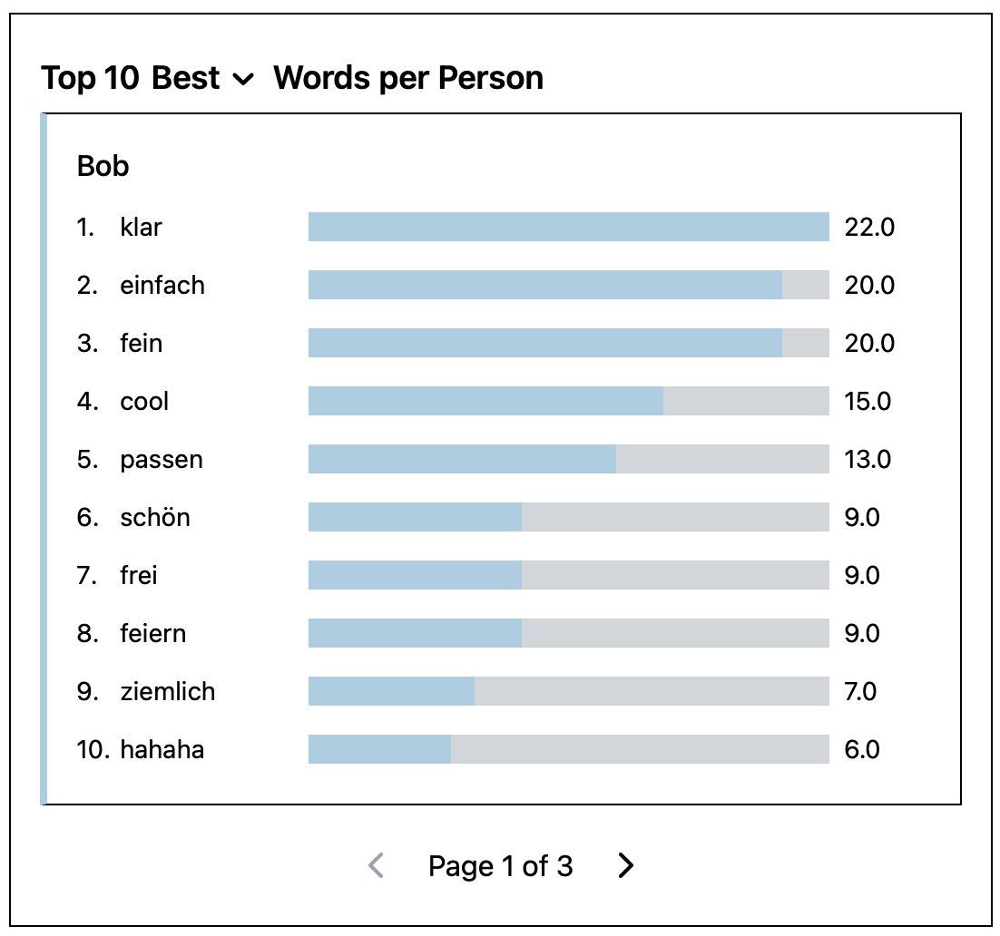

#### 10. **Interactive Heatmap (Heatmap.tsx)**

- Allows users to compare message frequency across different time dimensions.
- Users can select different granularities for both axes:
  - Hour, Day, Month, Year, Weekday
- Enables discovering peak activity times.
- 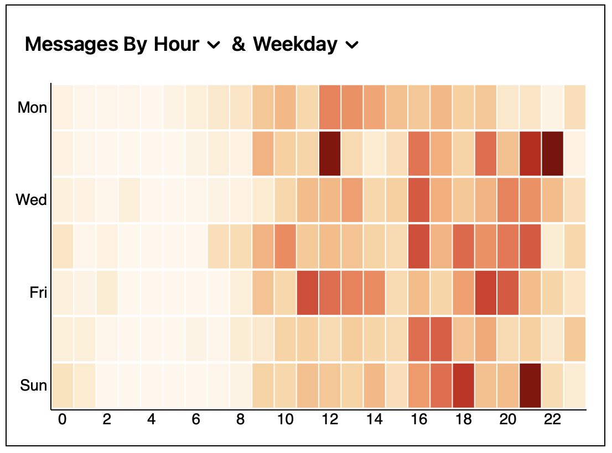

## Installation

1. **Clone the Repository**

```bash
git clone git@github.com:frievoe97/whatsapp-dashboard.git
cd whatsapp-dashboard
```

2. **Install Dependencies**

Ensure you have [Node.js](https://nodejs.org/) installed, then run:

```bash
npm install
```

3. **Run the Development Server**

```bash
npm run dev
```

Open `http://localhost:5173` in your browser.

4. **Build for Production**

```bash
npm run build
```

## Contributing

Contributions are highly encouraged! If you'd like to add new features or fix bugs, follow these steps:

1. **Fork the Repository**
2. **Create a Feature Branch** (`git checkout -b feature/new-feature`)
3. **Commit Your Changes** (`git commit -m "Added a new feature"`)
4. **Push to Your Branch** (`git push origin feature/new-feature`)
5. **Open a Pull Request**

## License

This project is licensed under the MIT License.
